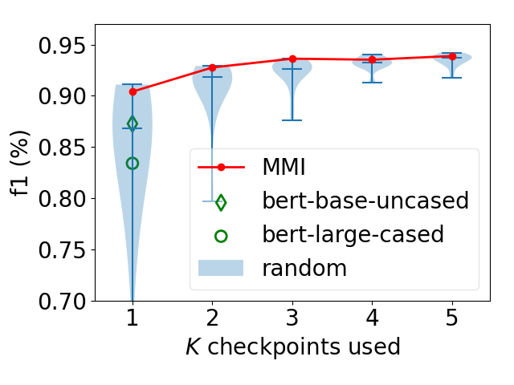
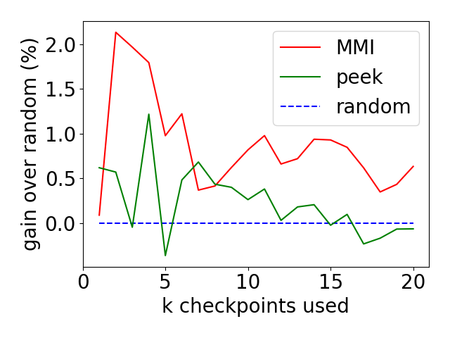

# Exploiting a Zoo of Checkpoints for Unseen Tasks  

<p align="left">

&nbsp; &nbsp; &nbsp; &nbsp; &nbsp; &nbsp; &nbsp; &nbsp

&nbsp; &nbsp; &nbsp; &nbsp; &nbsp; &nbsp; &nbsp; &nbsp

</p>

This repo includes code to reproduce all results in the above Neurips paper.

## Dependencies
We used python 3.8.5, but other versions close to that should also work. Install all required packages by
```
pip install --upgrade pip
pip install -r requirements.txt
```
We used cuda 10.2.89, but any version that meets pytorch's requirement should also work.


## Highlight of Results

We highlight some major results in the paper. A reader does not have to read the paper to grasp the main ideas. The paper tries to answer the question:	

*"Can we use a checkpoint zoo to build something that can adapt to unseen tasks?"*

To answer the question, first we need to understand the geometry of a space of tasks.

### Characterize the Task Space

In the paper, we model the tasks as following a Gaussian process. Its covariance is computed by applying [kernel alignment](https://proceedings.neurips.cc/paper/2001/file/1f71e393b3809197ed66df836fe833e5-Paper.pdf) to extracted features. The features are obtained by inputting probe data into checkpoints, each was trained for a task. For example, using 34 checkpoints from [Huggingface models](https://huggingface.co/models), we can estimate the 34x34 covariance (of their corresponding tasks).
<p align="center">

</p>

To reproduce the above figure, refer to [LMs/README.md](LMs/README.md).

#### Exploit the Task Space

We **hypothesize** that **representative** tasks are more **generalizable** to new tasks. This, of course, needs a rigorious mathematical proof. But empirically we find it is true, as indicated by the experiments on [NLP](#Linguistic-Tasks) and [vision](#Computer-Vision-Tasks) tasks.

So, how to identify **reprentative** tasks? They are supposed to convey the most information about the rest of the task space. We formulate the problem into a Max-Mutual-Information (**MMI**) objective. The solver takes the covariance as input, and greedily picks reprentative tasks.

#### Linguistic Tasks

Using the 34x34 covariance matrix, we can identify that the 5 most representative tasks are those corresponding to roberta-base, distilbert-base-uncased, t5-base, bert-base-cased and bart-large. Combining these checkpoints yields superior results on 8 new linguistic tasks, e.g., below is an example of chunking task.
<p align="center">

</p>

Check [LMs/README.md](LMs/README.md) for reproducing full results on computational linguistics.


### Computer Vision Tasks
The observation holds for vision tasks too. Below is an experiment set up on cifar100. MMI shows steady gain over random selection, and outperforms another baseline.
<p align="center">

</p>

Check [vision/README.md](vision/README.md) for reproducing results on computer vision.

## Additional Comments
***Note:*** This project requires running many small jobs. So it will be very useful if you have a cluster powered by slurm, which can launch jobs in parallel. In the job-launching scripts, you can see multiple commands like
```
sbatch -p $partition --gres=gpu:1 --wrap "python run.py" -o $job_log_path
```
If you do not have such a cluster, just use
```
python run.py > $job_log_path
```
instead.
